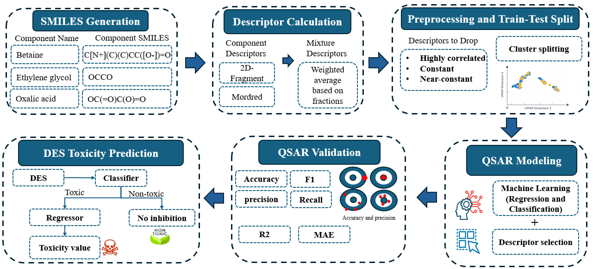

# toxNADES
Supporting materials for the paper: *"Data-Driven Toxicity Prediction of Deep Eutectic Solvents Using a Combined Classification and Regression QSAR Workflow"*.

## Workflow diagram
The repo-root image below is included for visualization on GitHub:



## Repository contents
This repository contains precomputed model artifacts (train/test splits and trained scikit-learn models) plus a small set of scripts for reproducing key figures from the paper.

Key files/folders:
- `models.py`: Loads trained regression models from `./regression/*` and regenerates plots (Williams plot + predicted-vs-true scatter) for each folder. It also contains helper methods for cross-validation and SHAP plots.
- `classification/<organism>/ga_feature_selection_classification.py`: Genetic-algorithm (DEAP) feature selection for classification, then trains a `RandomForestClassifier` using the selected features.
- `regression/<organism>/utils.py`: Helper functions used for the regression workflow (feature selection, clustering/splitting utilities, and plotting helpers).

## Requirements
There is no single `requirements.txt` in this repo; the scripts import these common Python dependencies:
- `python` (3.x)
- `numpy`, `pandas`
- `scikit-learn`
- `matplotlib`
- `shap`
- `deap`
- `mlxtend`
- `umap-learn`
- `seaborn`

## Quick start

### 1) Regenerate regression plots
`models.py` is configured to iterate over every subfolder in `./regression/*`.

Run:
```sh
python models.py
```

For each regression folder, `models.py` expects:
- exactly one `.pkl` model file in that folder
- `X_train.csv`, `y_train.csv`, `X_test.csv`, `y_test.csv`

It generates/overwrites:
- `williams_plot.png`
- `scatter_plot.png`

Note: SHAP plotting is implemented in `ModelHandler.plot_shap_beeswarm(...)`, but the call is currently commented out in `models.py`.

### 2) Run GA feature selection (classification)
To run the classification GA script for a specific organism, execute it from that organism folder, for example:
```sh
cd classification/ecoli
python ga_feature_selection_classification.py
```

The script expects the following CSVs in the current directory:
- `X_train_balanced.csv`, `y_train_balanced.csv`
- `X_test.csv`, `y_test.csv`

## Outputs
Many example outputs (plots and artifacts) are already checked into the per-organism folders under:
- `classification/`
- `regression/`

## License
MIT (see `LICENSE`).
